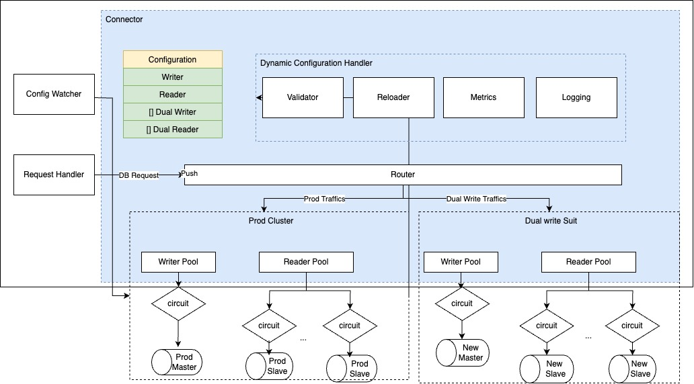
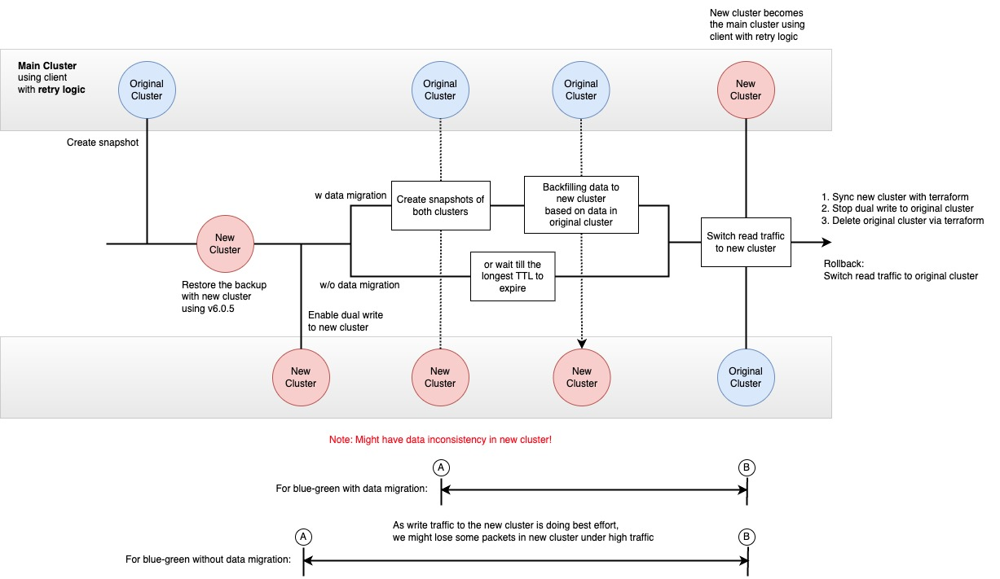

# Grab Redis Library

## Introduction

Redis is widely used as an in-memory database across tech companies, including Grab. Our services typically utilize a Redis client, such as go-redis. Nonetheless, we've encountered challenges with dynamic configuration, circuit breaker support, and data migration. The Spiderman Redis Library is our solution to enhance Redis's performance, resilience, and migration capabilities at Grab.

## Problem Statement

The challenges with existing methods are:

- **Dynamic Configuration:** Changes to connection pool sizes and routing strategies require restarting the service, which can cause disruptions.

- **Circuit Breaker Support:** Lacking the ability to handle node-specific failures efficiently, leading to potential overreactions when a circuit breaker opens.

- **Data Migration:** Seamless migration without downtime is cumbersome, especially in an AWS environment where access to certain Redis commands may be restricted.

## Solution

Grab Redis Library, built on go-redis, introduces:

- **Dynamic Configuration:** Supports real-time changes to Redis settings without service restarts.

- **Node-Level Circuit Breaker:** Allows resilient failover by isolating problems to specific nodes without affecting the entire cluster.

- **Data Migration Support:** Provides strategies for data migration with an aim to minimize downtime and data loss.

## Architecture



### Dynamic Configuration Support

Dynamic adjustment to connection pools is implemented with gradual, latency-aware pool size changes.

### Node-Level Circuit Breaker for Redis

The library leverages go-redis interfaces to inject custom limiter logic, such as:

# Data Migration Support

The Grab Redis Library offers two strategies for data migration:

- **Asynchronous Write:** For cache-like use cases where slight data loss is acceptable.
- **Synchronous Write:** For critical services where data preservation during migration is essential.

## Impact

The Grab Redis Library has successfully facilitated zero downtime during Redis upgrades, reducing the impact of circuit breaker activations. It has also streamlined configuration management for Grab's service teams.

## Usage

To integrate the Grab Redis Library into your project, follow these steps:

### 1. Import the library:

```go
import (
    "github.com/grab/grab-redis"
)
```

### 2. Dependency injection:

#### a. Inject your configuration center SDK if you want to have dynamic configuration:
```go
package redis

import (
	"context"

	confsdk "path/conf/sdk"
)

type Configurer struct {
	keyPath   string
	callback  func() error
	confClient conf.Client
}

func (c *Configurer) OnChange(callback func() error) {
	c.callback = callback
}

func (c *Configurer) Unmarshal(obj interface{}) error {
	v := c.confClient.Get(c.keyPath)

	if v.HasValue() {
		err := v.Unmarshal(obj)
		if err != nil {
			return err
		}
	}

	return nil
}

func getConfigurer(ctx context.Context, keyPath string, confClient confsdk.Client) (*Configurer, error) {
	c := &Configurer{
		keyPath:   keyPath,
		confClient: confClient,
	}

	confClient.On(keyPath, func(_ string, _, _ confsdk.Value) {
		c.callback()
	})
	return c, nil
}
```
#### b. Inject your logging and stastd SDK if you want to look at those info:

```go
package redis

import(
	"time"
	
	redis "github.com/grab/grab-redis"
)

// YourLogger is an implementation of Logger that does not log any messages.
type YourLogger struct{}

// Error does nothing.
func (l *YourLogger) Error(packageName string, format string, args ...interface{}) {}

// Warn does nothing.
func (l *YourLogger) Warn(packageName string, format string, args ...interface{}) {}

// Info does nothing.
func (l *YourLogger) Info(packageName string, format string, args ...interface{}) {}

// ServiceDown does nothing.
func (l *YourLogger) ServiceDown(name string, err error) {}

// ContextError does nothing.
func (l *YourLogger) ContextError(name string, err error) {}

// NewYourLogger returns a new instance of a logger that does not perform any logging.
func NewYourLogger() redis.Logger {
	return &YourLogger{}
}

// YourStatsClient is an implementation of StatsClient that does not record any statistics.
type YourStatsClient struct{}

// Count1 does nothing.
func (n *YourStatsClient) Count1(pkgName string, metric string, tags ...[]string) {}

// Gauge does nothing.
func (n *YourStatsClient) Gauge(name string, metric string, value float64, tags []string) {}

// Duration does nothing.
func (n *YourStatsClient) Duration(name string, elapsed string, now time.Time, tags ...string) {}

// NewYourStatsClient returns a new instance of StatsClient that does not record any statistics.
func NewYourStatsClient() redis.StatsClient {
	return &YourStatsClient{}
}
```
### 4. Setup your Redis client:

####  a.if you want to have dynamic configurations:

```go
 
func initConfWatcher(ctx context.Context, key string) (*Configurer, error) {
   c := &Configurer{
      keyPath: key,
   }
   
   confClient, _ := confsdk.NewConfClient(c.filePath)
   confClient.On("con", func(_ string, _, _ confsdk.Value) {
      c.callback()
   })
   return c, nil
}

config, err := initFileWatcher(context.Background(), "key")
connector, err := NewDynamicConnector(context.Background(), config)
```

####  b.if you want to have static configurations:

```go
config := redis.ConnectorConfig{
Client: &redis.ClientConfig{
// ...
},
}
    client, err := redis.NewStaticConnector(context.Background(), &config)
```
Note that if you want to use the static configuration, you won't be able to use the data migration feature as it need to have the dynamic configuration support.

### 5. Circuit breaker setup:

#### Circuit Breaker Configuration Options

| Option Name | Required | Default | Type | Description |
| ----------- | -------- | ------- | ---- | ----------- |
| `HystrixEnabled` | T | `False` | bool | Option for whether to use a circuit breaker or not. |
| `TimeoutInMs` | T | `31000` ms | int | Duration to wait for command to complete, in milliseconds. |
| `MaxConcurrentRequests` | T | `5000` | int | Maximum number of commands of the same type that can run at the same time. |
| `RequestVolumeThreshold` | T | `20` | int | Minimum number of requests needed before a circuit can be tripped due to health. |
| `ErrorPercentThreshold` | T | `50` | int | Percentage threshold of request failures that causes circuits to open. |
| `SleepWindowInMs` | T | `5000` ms | int | Duration in milliseconds to wait after a circuit opens before testing for recovery. |
| `QueueSizeRejectionThreshold` | T | `50` | int | Maximum number of requests that can be waiting in queue before requests are rejected. |

You need to setup those options in your configuration's file regrading to your needs.

### 6. Migration setup: 

#### Migration Configuration Options

| Parameter                          | Type    | Default | Scope                | Description                                           |
|------------------------------------|---------|---------|----------------------|-------------------------------------------------------|
| `ConnectorWorkerIdleTimeout`       | int     | 1s      | Dual write scheduler | The amount of time a worker can be idle before timing out. |
| `ConnectorMaxWorker`               | int     | 10000   | Dual write scheduler  | The maximum number of workers that can be created for handling tasks. |
| `ConnectorMaxChanSize`             | int     | 10      | Dual write scheduler  | The maximum size of the channel for managing tasks.   |
| `ConnectorProcessAllLoadTestPackets` | bool    | False   | Dual write scheduler  | Determines if all packets should be processed to load test the Redis server or if some can be abandoned. |

We encourage you to choose the configuration that best suits your needs when you create client.

#### Migration SOP


Basic idea is 
1. Add the new cluster address to the client's configuration when you want to start migrating.
2. The client will start dual write to both cluster, while read traffic go to the old cluster.
3. When you want to stop migrating, switch both read/write traffic to the new cluster, and remove the old cluster from the client's configuration.

## Contributing

Contributions to the Grab Redis Library are welcomed. To contribute, please follow these steps:

1. Fork the repository.
2. Create a new feature branch.
3. Implement your feature or bug fix.
4. Write tests covering your changes.
5. Commit and push your code.
6. Submit a pull request for review.

## Join Us

Grab is Southeast Asia's premier superapp platform, providing a wide range of services to consumers. If you're passionate about creating economic empowerment for everyone in Southeast Asia, consider joining our team!


